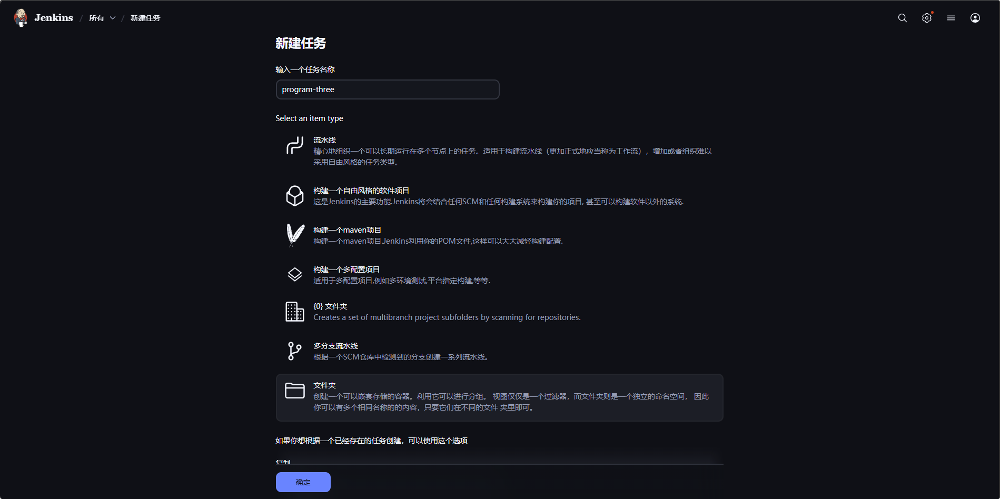
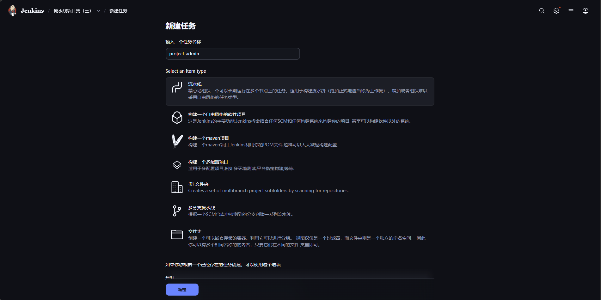
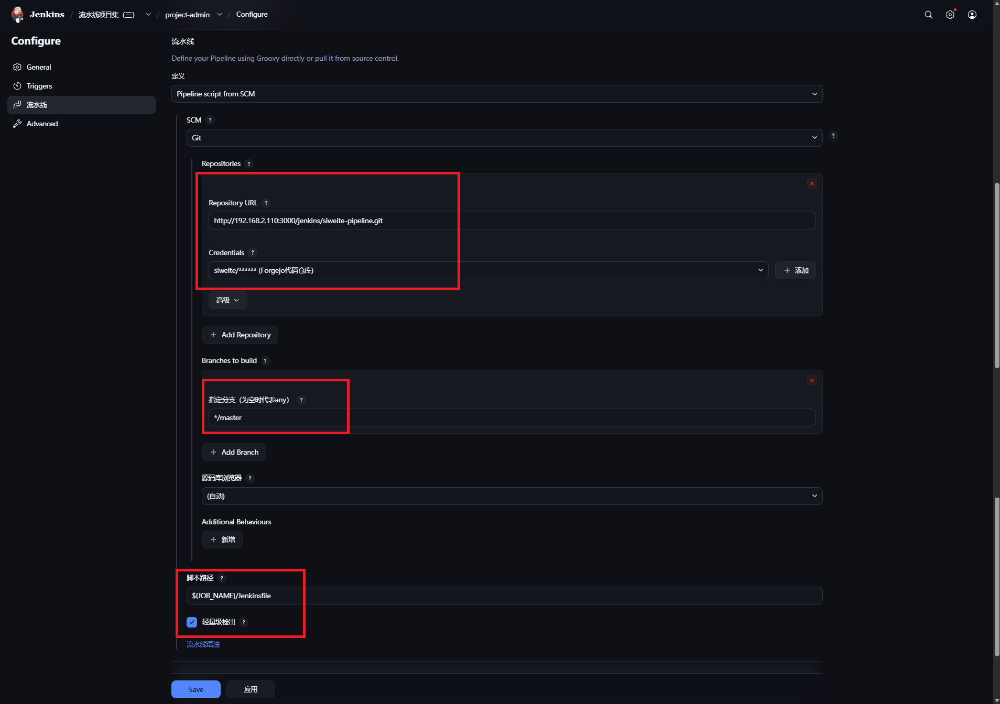

# 搭建流水线

## 流水线仓库

> 流水线仓库目录结构(建议)，后续的文档会以该目录结构进行说明
>
> 待上手整个结构后，可以根据自己的需求调整流水线仓库项目结构，也可以分成多个仓库进行管理

```text
siweite-pipeline - 仓库名称
├── program-one - 流水线项目集（一） 
├── program-two - 流水线项目集（二）
├── program-three - 流水线项目集（三）
│   ├── project-commons - 某公共项目（`javaPublishMaven`示例）
│   │   └── Jenkinsfile - 流水线脚本（必选）
│   ├── project-admin - 某后台项目
│   │   ├── resource - 资源/配置文件（可选）
│   │   ├── default.conf - Nginx配置文件（可选）
│   │   ├── Dockerfile - 构建`Docker`镜像的指令文件（必选）
│   │   ├── run.sh - 启动服务的执行命令（可选）
│   │   └── Jenkinsfile - 流水线脚本（必选）
│   ├── project-cloud - 某后台微服务项目
│   │   ├── resource - 资源/配置文件（可选）
│   │   ├── siweite-gateway - 服务模块A（可选）
│   │   │   ├── Dockerfile - 构建`Docker`镜像的指令文件（必选）
│   │   │   ├── run.sh - 启动服务的执行命令（可选）
│   │   ├── siweite-oauth - 服务模块B（可选）
│   │   ├── siweite-system - 服务模块C（可选）
│   │   ├── Dockerfile - 构建`Docker`镜像的指令文件（必选）
│   │   ├── run.sh - 启动服务的执行命令（可选）
│   │   └── Jenkinsfile - 流水线脚本（必选）
│   ├── project-web - 某前端项目（`nodeDeployDocker`示例）
│   │   ├── resource - 资源/配置文件（可选）
│   │   ├── default.conf - Nginx配置文件（可选）
│   │   ├── Dockerfile - 构建`Docker`镜像的指令文件（必选）
│   │   └── Jenkinsfile - 流水线脚本（必选）
└───└── project-website - 某网站项目
```

### `Jenkinsfile`

> 项目流水线的**核心**脚本文件

1. 示例：
    ```groovy
    @Library('jenkinsci-siweite-library@0.5.2') _
    // 控制参数
    def args = [
        // 部署项目名称
        projectName: 'project-common',
        // 项目标题
        projectTitle: '某系统平台[基础依赖]',
        // …… …… …… 省略中间参数
        // 编译打包命令，多行命令使用 \n 分割 或 使用 && 或者使用 多行
        buildCommand: '''
            mvn -v
            mvn clean deploy -Dmaven.test.skip=true -Dmaven.compile.fork=true
        ''',
        // 代码仓库凭证
        gitCodeAuth: 'b92981d8-f7c8-49f0-af5c-d65df797772b',
    ]
    // 运行流水线[Java发布私仓]
    SiweiteCI.javaPublishMaven(args)
    ```
2. `@Library('jenkinsci-siweite-library@0.5.2') _`
   > 引入共享库，流水线模板库
   >
   > 格式：@Library('共享仓库配置名称@仓库分支/仓库标签') _

3. `def args = [ ]`
   > 设置影响流水线运行的参数的配置，详见[支持的参数变量](./params.md)

4. `SiweiteCI.javaPublishMaven(args)`
   > 通过流水线模板运行流水线

   支持模板：

   | 标题                | 模板使用方法                                  | 阶段/步骤说明(`[]`：可选、`<>`：必选、`{}`：选项必选)                                 |
   |:------------------|:----------------------------------------|:-------------------------------------------------------------------|
   | Java 发布私仓         | `SiweiteCI.javaPublishMaven(args)`      | [清理缓存]→[仓库合并]→<项目编译>→<制作产物>→[发送通知]                                 |
   | Java Docker部署     | `SiweiteCI.javaDeployDocker(args)`      | [清理缓存]→[仓库合并]→<项目编译>→<覆盖配置>→[制作产物]→<制作镜像>→{推送私服\|传输镜像}→部署容器→[发送通知] |
   | Node Docker部署     | `SiweiteCI.nodeDeployDocker(args)`      | [清理缓存]→[仓库合并]→<项目编译>→<覆盖配置>→[制作产物]→<制作镜像>→{推送私服\|传输镜像}→部署容器→[发送通知] |
   | Java 多项目 Docker部署 | `SiweiteCI.javaMultiDeployDocker(args)` | [清理缓存]→[仓库合并]→<项目编译>→<覆盖配置>→[制作产物]→<制作镜像>→{推送私服\|传输镜像}→部署容器→[发送通知] |


### `resource`

> 需覆盖或新增项目的资源文件（**主项目拉取代码的相对路径**），如：`SpringBoot`多环境配置文件、`Node`多环境配置文件 或
> 需要覆盖的代码文件
>
> 问：为什么要把环境配置文件放在`resource`目录下？
>
> 答：开发资源和运维资源分离，开发人员无法从配置文件中查看到生产环境配置。
> 1. 防止开发误修改
> 2. 防止开发知道生产环境连接参数

### `default.conf`

> 项目的`Nginx`配置文件，用于`Dockerfile`制作镜像使用，不要求必须是`Nginx`，只是拿`Nginx`举例子
>
> 需不需要、文件名、文件内容是什么？都是由`Dockerfile`和项目需求决定

### `run.sh`

> 项目的启动命令，用于`Dockerfile`制作镜像使用
>
> 需不需要、文件名、文件内容是什么？都是由`Dockerfile`和项目需求决定

### `Dockerfile`

> 构建`Docker`镜像的指令文件

示例：

```dockerfile
# 基础镜像
FROM 192.168.2.110:5000/library/bellsoft/liberica-openjre-rocky:21
LABEL maintainer=siweite
# 设置时区
ENV TZ=Asia/Shanghai
RUN ln -sf /usr/share/zoneinfo/$TZ /etc/localtime && echo $TZ >/etc/timezone
# 设置中文字符集
ENV LANG=zh_CN.UTF-8 LANGUAGE=zh_CN:zh LC_ALL=zh_CN.UTF-8
# 指定运行时的工作目录
WORKDIR /opt/siweite
# 将构建产物jar包拷贝到运行时目录中
COPY *.jar ./app.jar
COPY ./run.sh run.sh
RUN chmod +x run.sh
# 指定容器内运行端口
EXPOSE 8080
# 指定容器启动时要运行的命令
ENTRYPOINT ["./run.sh"]
```

## 创建`Jenkins`任务

1. 创建文件夹（可选）
   > 如果流水线仓库是按照项目集进行管理，则需要这一步，文件夹名称与项目集名称一致(这样可以自动识别，否则需要手动修改任务配置)

   

2. 创建任务
   > 在上一步文件夹下创建任务(新建Item)，任务名称和项目名称一致(这样可以自动识别，否则需要手动修改任务配置)
   
   

3. 配置任务
   > 配置任务信息，按照配置填写即可，对于模板只关注流水线(pipeline)的配置

   

   - 选择从源码仓库拉取流水线配置 `Pipeline script from SCM`
   - 填写流水线仓库信息
   - 配置脚本路径：`${JOB_NAME}/Jenkinsfile`，`${JOB_NAME}`等于文件夹/任务名称，文件夹和项目集、任务和项目名称一致，就能找对应项目的`Jenkinsfile`

4. 构建参数落位
   > 构建参数需要执行一次才会在Jenkins中显示，将`pipeline`中配置的构建参数变成Jenkins的参数化构建

5. 正式运行流水线 

下一章：[支持的参数变量](./params.md)
